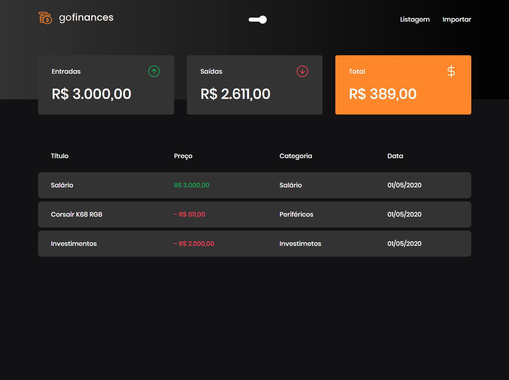
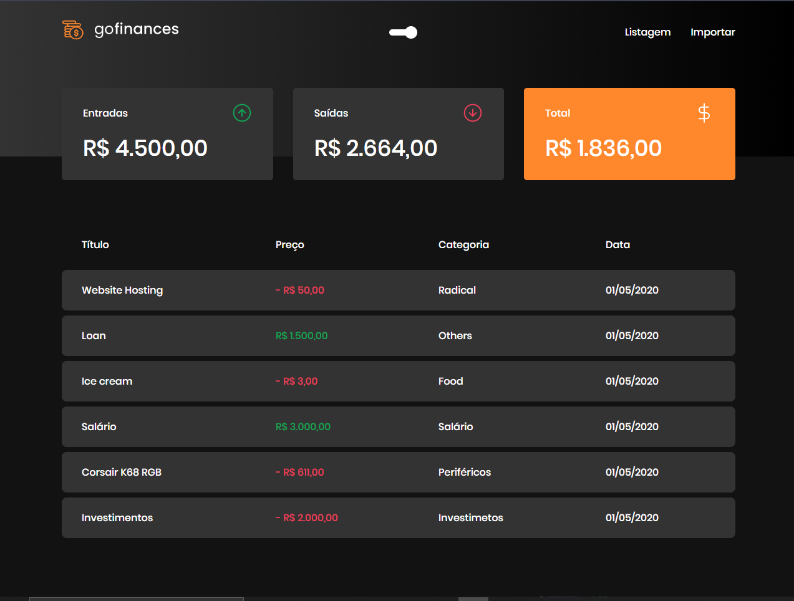
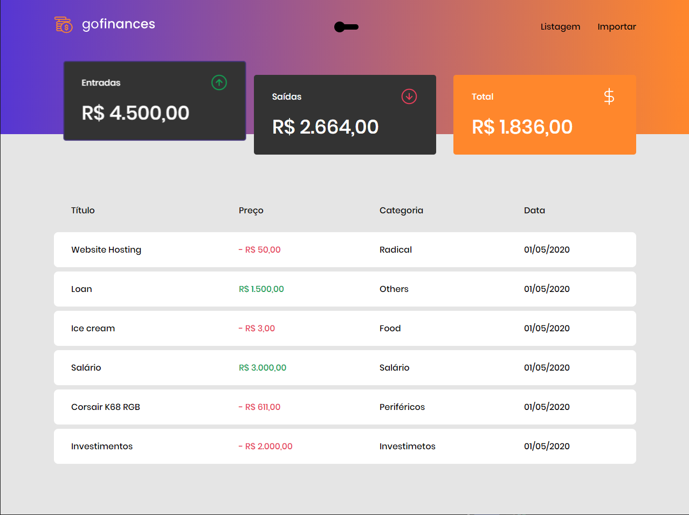
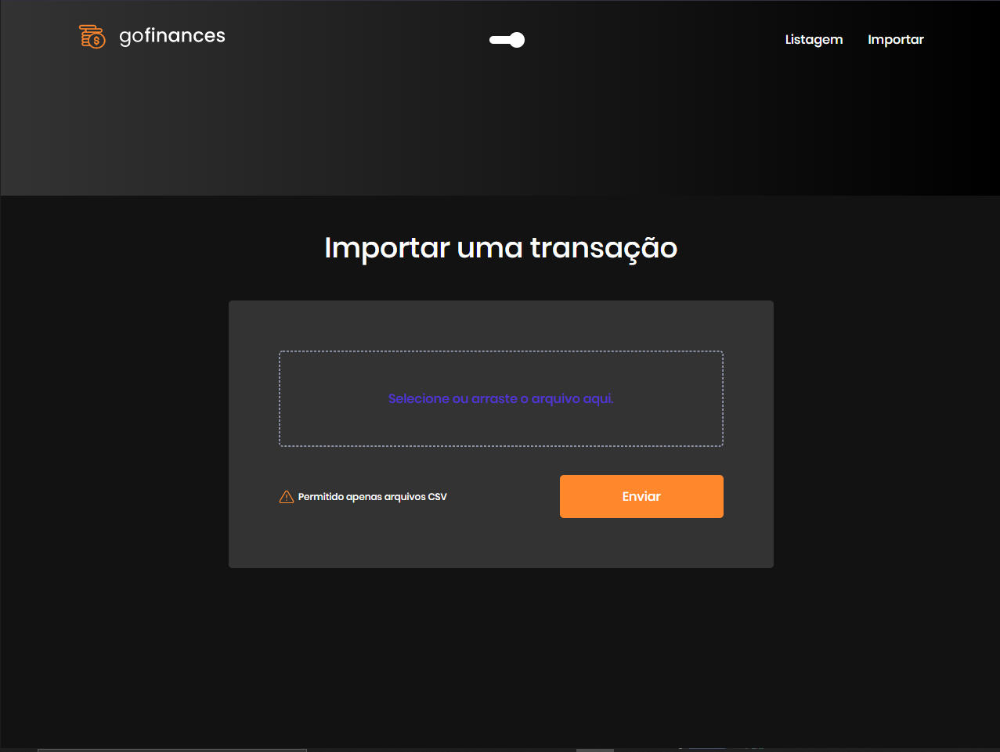
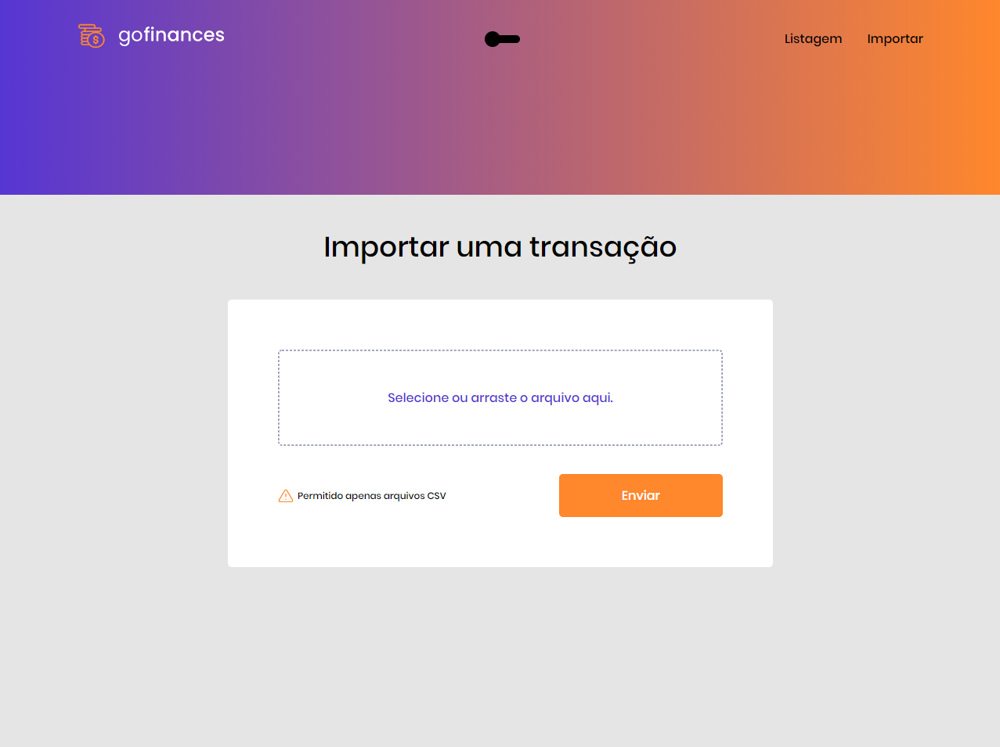

# GoFinancesWeb
Desafio 7 -  Go Finances Web fundamentos ReactJs

<h1 align="center">
   GoFinancesWeb
</h1>

 

## :camera: Demonstração

## :rocket: Tecnologias

Esse projeto foi desenvolvido com as seguintes tecnologias:

✔️Typescript

✔️React

✔️React Hooks

✔️Styled-components

✔️Polished

✔️Docker

✔️PostgreSQL

✔️Node

✔️Axios

## 💻 Projeto

GoFinances uma aplicação financeira consumindo a API do back-end, gerenciando transações.

### 💻 Run Web Project

1- Para instalar as dependências:
> yarn

2- Para iniciar a aplicação:
> yarn start

Go to http://localhost:3000/ to see the result.

  The GoStack 13 Go Finances Web - Desafio 7 project. Built with ❤︎ by
    <a href="https://github.com/Gilles30">Lorison Gilles</a> and
    <a href="https://github.com/Gilles30/GoFinancesWeb">
      contributors
    </a>
  

---

